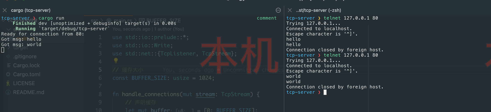

# rust-tcp-server


## 运行

```bash
cargo run
```

## 测试

```bash
> telnet 127.0.0.1 80
Trying 127.0.0.1...
Connected to localhost.
Escape character is '^]'.
world
world
Connection closed by foreign host.
```

## 截图



## 参考资料

- [Tcp Listener](https://doc.rust-lang.org/std/net/struct.TcpListener.html)
- [Tcp Stream](https://doc.rust-lang.org/std/net/struct.TcpStream.html)
- [单线程webserver](https://kaisery.github.io/trpl-zh-cn/ch20-01-single-threaded.html)
- [Rust Cookbook](https://rust-lang-nursery.github.io/rust-cookbook/net/server.html)
- [A simple TCP clientand server application](https://riptutorial.com/rust/example/4404/a-simple-tcp-client-and-server-application--echo)
